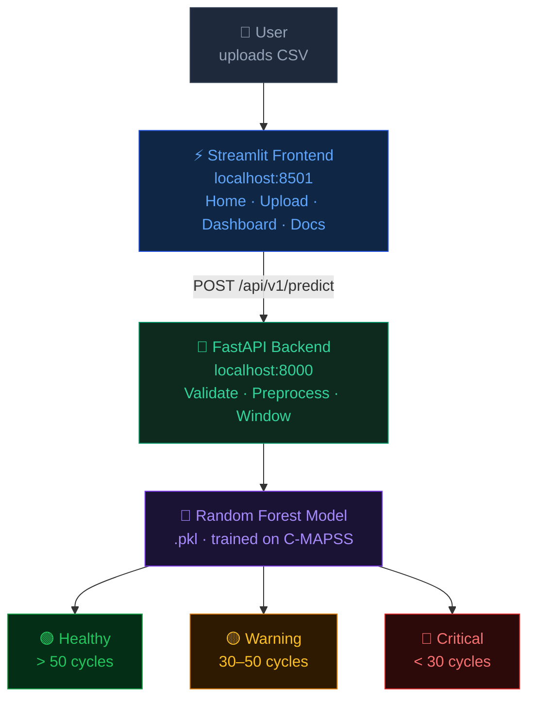

# ⚡ Equip-GuardianAngel


> AI-powered equipment health monitoring — predicts Remaining Useful Life (RUL) 
> from raw sensor data and classifies units as Healthy, Warning, or Critical.

---

## 📸 Demo
### Home Page


### Dashboard Page


### Docs Page


---

## 🏗️ Architecture



## 📊 Dataset

Uses NASA **C-MAPSS** (Commercial Modular Aero-Propulsion System Simulation):
- `FD001` — single operating condition, single fault mode.
- Each row = one sensor snapshot from one engine at one cycle.

---
## 🤖 Model

- **Algorithm**: Random Forest trained on windowed sensor sequences
- **Output**: Predicted remaining cycles per engine unit
- **Classes**:
  - 🟢 Healthy → > 50 cycles remaining
  - 🟡 Warning → 30–50 cycles remaining  
  - 🔴 Critical → < 30 cycles remaining

## 🚀 Run with Docker

```bash
git clone https://github.com/DouaaBennoune/EquipGuardianAngel.git
cd EquipGuardianAngel
docker-compose up --build
```

| Service | URL |
|---|---|
| Frontend | http://localhost:8501 |
| Backend API docs | http://localhost:8000/docs |

---

## 📁 Project Structure

```
├── app/
│   ├── api/          # FastAPI endpoints
│   ├── models/       # Pydantic schemas
│   ├── services/     # ML inference engine
│   └── utils/        # Preprocessing & validation
├── frontend.py        # Streamlit UI
├── Dockerfile.Backend
├── Dockerfile.frontend
└── docker-compose.yml
```
